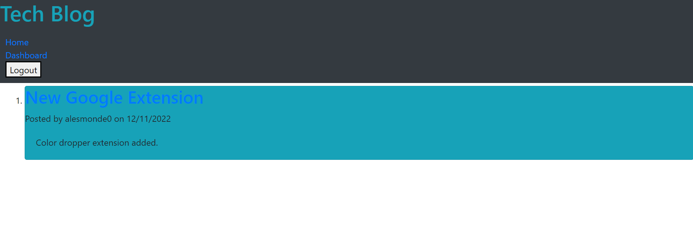

# tech blog

## Description 

---

Tech Blog is an online blog where developers have the ability to publish blog posts and comment on other users' blog posts as well. Additionally, users are able to edit and delete their own posts. This application follows the MVC paradigm in its structure and organization. Tech Blog uses Handlebars.js as the templating language, Sequelize as the ORM, and the express-session npm package for authentication. For further information on how to install and use this app, please see the Usage section of this README, as well as my GitHub repository [here](https://github.com/caitoreilly/tech-blog.git) and deployed application [here]().

## Table of Contents 

---

- [Technologies](#technologies)
- [Screenshot](#screenshot)
- [Questions](#questions)

## Technologies 

---

In order to install and use this application, you will need to use the following technologies on your local device:

- express-handlebars package
- MySQL2 package
- Sequelize package
- Express.js API 
- dotenv package
- bcrypt package
- express-session and connect-session-sequelize packages 

It is important to log into your MySQL account in your terminal. Then be sure to run the command "npm run seed" followed by the command "npm start" to begin!

## Screenshot

---

This image displays the homepage of the Tech Blog web application.

.

## Questions 

--- 

If you have any questions about this project, please feel free to contact me directly via email at coreilly29@gmail.com.
You can also view my additional projects at https://github.com/caitoreilly.